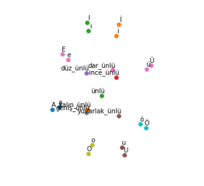
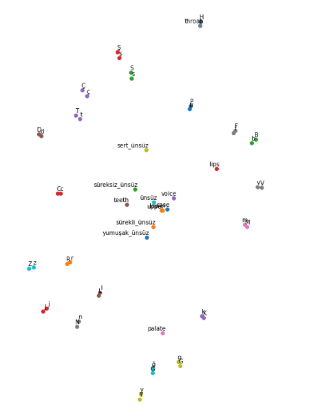
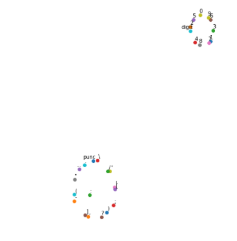

# CharacterEmbeddings

This is an experimental repo dedicated on character representation. 
Character representation is rather a fun problem where input symbols are 
bounded as opposed to words. It is also a "relevant" problem as there
are models performing on character level.

## Poincare Embeddings

Poincare embeddings [1] was introduced to capture the hierarchical nature 
of word representations. 

The question for me is, are characters hierarchical?. If so can I define 
their relation to each other and derive good representations as a result. 

I tried just that and then made a plot to see if those representations 
makes any sense. Below are some screenshots of the clusters within that
plot.  

From what I see from the plot these representations look usable, but upon
some further investigation some features are lost.  

## References
1. Nickel, Maximilian and Kiela, Douwe. Poincaré Embeddings for Learning Hierarchical Representations. Advances in Neural Information Processing Systems 30, 6341--6350. IEEE, 2017. [http://papers.nips.cc/paper/7213-poincare-embeddings-for-learning-hierarchical-representations.pdf]
